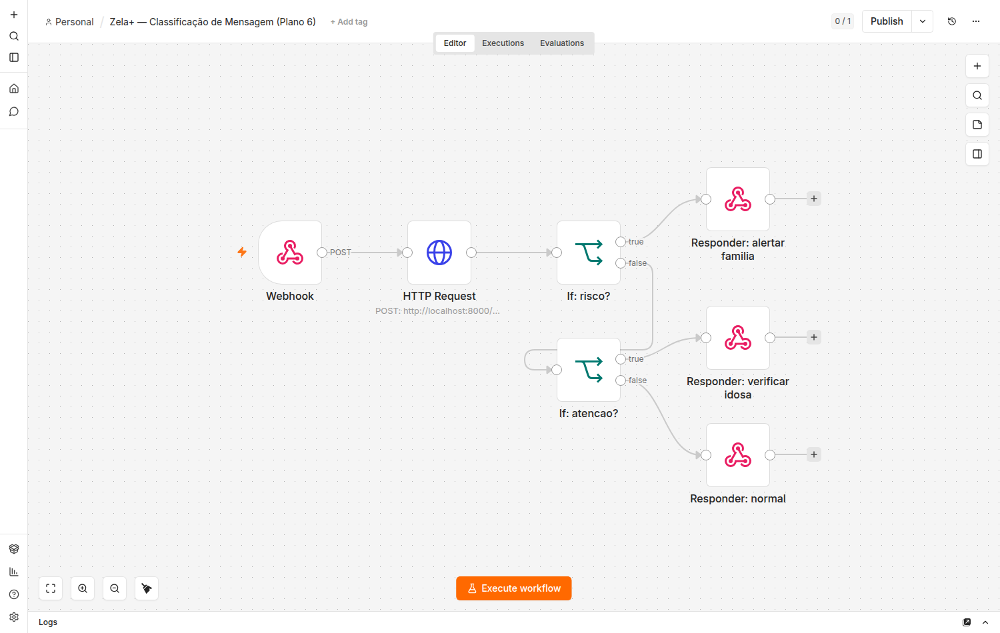
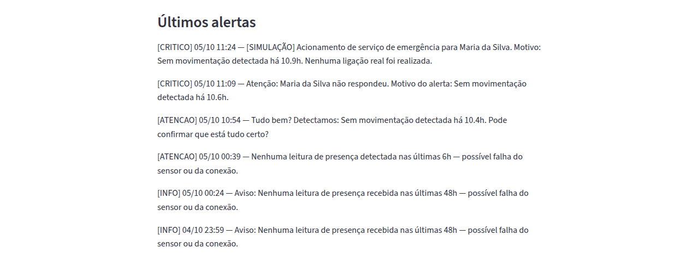
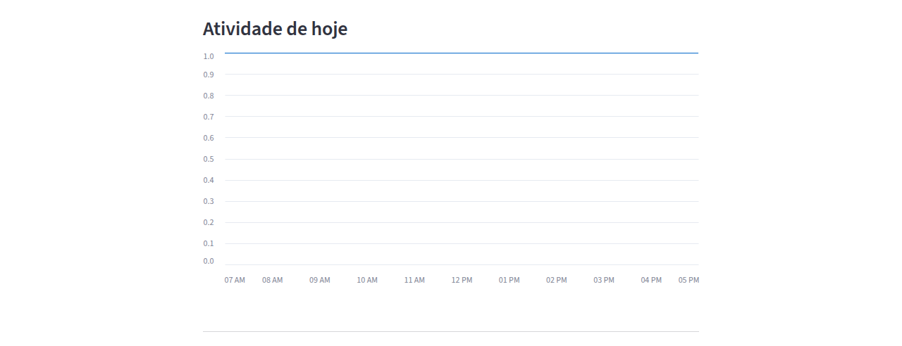

# Zela+ — Relatório do Trabalho Final (Agentes de IA)

**Autor:** Lucas Augusto
**Repositório:** (link do GitHub a ser preenchido na entrega do card)
**Vídeo pitch:** ver `docs/pitch/roteiro.md` para o roteiro; o arquivo de vídeo fica em `docs/pitch/zela-pitch.mp4` no repositório.

---

## 1. Descrição do projeto

### 1.1 Problema

Idosos que moram sozinhos enfrentam três riscos recorrentes que motivaram
este projeto, a partir de um caso real (avó do autor, que mora sozinha):

1. **Esquecimento de medicação e compromissos** — sem alguém por perto para
   lembrar, doses e consultas são perdidas.
2. **Falta de detecção precoce de risco** — uma queda, uma ausência de
   movimento prolongada, ou uma alteração de sinais vitais pode passar
   despercebida por horas.
3. **Família fora do loop** — parentes que não moram junto não têm
   visibilidade do dia a dia (a medicação foi tomada? está tudo bem hoje?)
   sem ligar toda hora, o que é cansativo para os dois lados.

### 1.2 Oportunidade e escopo do MVP

O escopo mínimo viável do Zela+ cobre as três dores acima com o menor
conjunto de funcionalidades que já demonstra valor de ponta a ponta:

- Lembretes de medicamentos/compromissos via WhatsApp, com confirmação
  pelo próprio idoso.
- Monitoramento de risco combinando sensores reais (presença via ESP32,
  sinais vitais via smartwatch) e a interpretação de mensagens de texto do
  idoso (classificadas por similaridade de embeddings).
- Uma escada de escalonamento determinística (nunca decidida por um LLM)
  que avisa a família e, em último caso, simula contato com um serviço de
  emergência.
- Um painel Streamlit para a família acompanhar status, medicação, alertas
  e um histórico de presença, além de cadastrar/editar medicamentos e
  compromissos.
- Um fluxo visual (n8n) que demonstra separadamente a lógica de
  classificação de urgência de uma mensagem, item explicitamente pedido
  pelo card (o curso migrou de Langflow para n8n — ver nota na seção 3.4).

Ficou **fora** do escopo do MVP (documentado como trabalho futuro):
transcrição de áudio (STT/TTS) nas mensagens de WhatsApp, autenticação
robusta nos endpoints internos, e um piso de confiança mínimo no
classificador de urgência por similaridade — ver seção 6.

---

## 2. Arquitetura do agente/sistema multiagente

O Zela+ usa uma arquitetura de **5 agentes especializados**, orquestrados
pelo Google ADK, cada um com responsabilidade única e um contrato de dados
Pydantic próprio:

```
                         ┌─────────────────────────┐
        WhatsApp ───────▶│   Agente de Comunicação  │◀──────── Streamlit
     (idoso, texto/áudio)│  (STT/TTS, roteamento)   │      (dashboard família)
                         └────────────┬─────────────┘
                                      │
                                      ▼
                         ┌─────────────────────────┐
                         │   Agente Orquestrador    │  (ADK root agent)
                         └──┬──────┬──────┬─────────┘
                            │      │      │
              ┌─────────────┘      │      └─────────────┐
              ▼                    ▼                     ▼
   ┌──────────────────┐ ┌────────────────────┐ ┌────────────────────┐
   │ Agente de Rotina/ │ │ Agente de          │ │ Agente de          │
   │ Medicação         │ │ Monitoramento de   │ │ Emergência/Alertas │
   │ (agenda, lembrete)│ │ Saúde/Risco        │ │ (aciona família /  │
   └──────────────────┘ │ (embeddings p/     │ │  serviço emerg.,   │
                         │  classificar risco)│ │  simulado)         │
                         └─────────┬───────────┘ └────────────────────┘
                                   │
                     ┌─────────────┴─────────────┐
                     ▼                            ▼
           Mi Band 9 (Health Connect,       ESP32 (HC-SR04 presença)
           via Health Connect Webhook)
```

**Decisão de design mais importante do projeto:** a decisão de escalonar
uma emergência (avisar a família, simular contato de emergência) **nunca**
é tomada por um LLM. Ela é calculada por uma máquina de estados
determinística e pura (`zela/domain/emergencia.py` +
`zela/storage/escalonamento.py`), testada exaustivamente com `pytest`. Os
agentes de IA (inclusive o classificador de urgência por embeddings)
apenas **alimentam** essa máquina com eventos (`EventoMonitoramento`) — a
decisão de agir sobre um evento de risco é sempre determinística e
auditável, nunca uma alucinação do modelo.

### 2.1 Papel de cada agente

| Agente | Responsabilidade | Ferramentas (tools ADK) |
|---|---|---|
| **Orquestrador** (`orquestrador_zela`) | Direciona cada mensagem ao agente especializado certo | — (`sub_agents`) |
| **Rotina/Medicação** | Lembretes de medicamentos/compromissos, registra confirmações | `verificar_lembretes_pendentes`, `confirmar_medicamento` |
| **Monitoramento de Saúde/Risco** | Relata o status já calculado (normal/atenção/risco) | `consultar_status_atual` |
| **Comunicação** | Conversa com idoso/família, busca RAG em bulas e mensagens passadas | `consultar_conhecimento` |
| **Emergência/Alertas** | Relata alertas e ocorrências já registrados | `consultar_historico_alertas` |

Nenhum agente decide sozinho um estado de risco ou dispara um alerta real
— todos consultam ferramentas que refletem cálculos já feitos pela camada
de domínio (`zela/domain/`), pura e testável sem LLM nem rede.

### 2.2 Fluxo de ponta a ponta (exemplo)

1. Hora de um remédio → Agente de Rotina dispara lembrete → Agente de
   Comunicação envia a mensagem via WhatsApp ao idoso.
2. Idoso confirma por WhatsApp → Orquestrador registra a confirmação.
3. Em paralelo, o Agente de Monitoramento consome leituras do smartwatch e
   do ESP32 (a cada 15 min) e mensagens de texto do idoso (classificadas
   por embeddings), gerando um status: `normal` / `atenção` / `risco`.
4. `atenção` → aviso à família via Streamlit/histórico de alertas.
5. `risco` → escalonamento determinístico: contato com o idoso → família →
   simulação de contato de emergência.
6. A família consulta o Streamlit a qualquer momento.

---

## 3. Detalhamento técnico

### 3.1 Validação de dados com Pydantic (card 3.3)

Todos os dados que entram no sistema — leituras de sensor, mensagens de
WhatsApp, cadastro de medicamentos, perfil do idoso — são validados por
modelos Pydantic antes de tocar qualquer lógica de negócio:

- `zela/models/perfil.py` — `PerfilIdoso`, `ContatoFamiliar`
- `zela/models/rotina.py` — `Medicamento`, `Dosagem`, `Compromisso`,
  `ConfirmacaoMedicacao` (com validação de que `data_hora` de um
  compromisso não pode estar no passado na criação)
- `zela/models/monitoramento.py` — `LeituraSensor`, `EventoMonitoramento`,
  além dos enums `StatusMonitoramento` (normal/atenção/risco),
  `MetodoClassificacao`
- `zela/models/alertas.py` — `Alerta`, com os enums `NivelAlerta`,
  `CanalAlerta`, `StatusAlerta`
- `zela/models/comunicacao.py` — `MensagemEntrada`, `TipoMensagem`

Um caso não-trivial de uso de Pydantic: o modelo `Compromisso` valida que
a data não é passada **na criação**, mas ler um compromisso histórico do
banco (já no passado, por definição) precisa contornar essa mesma
validação — resolvido com `Compromisso.model_construct(...)` no caminho
de leitura (`zela/storage/rotina.py::_linha_para_compromisso`), preservando
a validação onde ela importa (escrita) sem quebrar a leitura de dados
antigos.

### 3.2 Embeddings e RAG (card 3.5)

Duas aplicações de embeddings no MVP, ambas usando a API de embeddings do
Gemini (`zela/embeddings/client.py`):

1. **Classificação de urgência por similaridade** (`zela/embeddings/classificador.py`):
   uma mensagem de texto do idoso (ex.: "caí no banheiro e não consigo
   levantar") é comparada por similaridade de cosseno contra 18 exemplos
   de referência rotulados em português (`zela/embeddings/exemplos_referencia.py`)
   e classificada como `NORMAL` / `ATENCAO` / `RISCO` pelo vizinho mais
   próximo. O resultado alimenta a mesma máquina de escalonamento usada
   pelos sensores — nunca decide um alerta sozinho.
2. **RAG (Retrieval-Augmented Generation)** sobre bulas de medicamentos
   cadastrados e o histórico de mensagens do idoso, usando um vector store
   Chroma local (`zela/embeddings/vetorial.py`). O Agente de Comunicação
   usa isso para responder perguntas como "para que serve esse remédio?"
   ou "o que a vó disse ontem?" sem inventar uma resposta quando não há
   contexto relevante.

Decisão de implementação notável: o cliente de embeddings
(`ClienteEmbeddingGemini`) constrói o cliente real do Gemini de forma
**preguiçosa** (só na primeira chamada, nunca no `__init__`) — isso permite
importar o módulo em testes sem exigir uma chave de API configurada.

### 3.3 Orquestração multiagente com ADK (card 3.6)

A orquestração usa o Google Agent Development Kit (ADK):
`zela/agents/orchestrator.py` define os 5 agentes da seção 2.1 como
`google.adk.agents.Agent`, com o orquestrador registrando os 4
especializados como `sub_agents`. O roteamento entre eles é feito pelo
próprio ADK a partir da `instruction` de cada agente — não há um roteador
determinístico escrito à mão. As ferramentas (`tools`) de cada agente são
funções Python puras que chamam a camada de armazenamento/domínio, nunca
lógica de negócio direto no agente.

O comportamento pode ser verificado interativamente com `adk run
zela/agents` (ver README, seção "Verificando o comportamento do agente").

### 3.4 Workflow n8n (card 3.4/3.8)

**Nota sobre a ferramenta:** o card original menciona Langflow; o curso
migrou para n8n durante o desenvolvimento deste trabalho, então o fluxo
visual foi implementado em n8n (`docs/n8n/zela-classificacao-mensagem.json`).

O workflow representa, de forma simplificada e visual, a fatia "mensagem
recebida → classificação de urgência → roteamento" do sistema: um nó
Webhook recebe a mensagem, um nó HTTP Request chama o endpoint real do
backend (`POST /api/classificar-mensagem`, que reusa o mesmo classificador
por embeddings da seção 3.2), e dois nós `If` encadeados roteiam a
resposta para um de três nós de resposta (`alertar_familia` /
`verificar_idosa` / `normal`) conforme o status retornado. Ele não
substitui a integração real WhatsApp↔backend (que continua funcionando
via WAHA, seção 3.6) — é uma demonstração visual isolada da lógica de
classificação/roteamento, como pede o card.



*(capturar após importar o workflow no n8n — instruções em `README.md`,
seção "Workflow n8n (Plano 6)")*

### 3.5 Interface de usuário com Streamlit (card 3.7)

O painel Streamlit (`zela/streamlit_app/`) é a interface da família:
status atual, medicação do dia, histórico de alertas e um gráfico de
presença (leitura, somente exibição), além de formulários para
cadastrar/editar medicamentos e compromissos (escrita). Acesso protegido
por senha (`STREAMLIT_SENHA`), com uma tela de erro amigável em vez de
stack traces para qualquer seção que falhe.

| Seção | Captura de tela |
|---|---|
| Status atual |  |
| Medicação do dia |  |
| Histórico de alertas |  |
| Gráfico de presença |  |

*(capturas a adicionar em `docs/relatorio/imagens/` — instruções de como
rodar o painel em `README.md`, seção "Painel Streamlit (Plano 5)")*

### 3.6 Comunicação via WhatsApp (card 3.8)

A comunicação com o idoso e a família acontece via WhatsApp, integrada por
meio do WAHA (WhatsApp HTTP API) — um webhook (`zela/api/webhook.py`)
recebe mensagens recebidas pelo WAHA e as encaminha para o ADK Runner, que
roteia ao agente apropriado; o cliente WAHA (`zela/integrations/waha_client.py`)
envia as respostas de volta. Ver README para o passo a passo de
configuração (Docker Compose + QR code + webhook).

---

## 4. Resultados obtidos

*(Detalhamento completo — estratégia de testes, justificativa de cada
decisão de design, cobertura por arquivo e o que fica fora da suíte
automatizada — em `docs/testes/estrategia-e-resultados.md`.)*

- **186 testes automatizados** passando (`pytest -v`), cobrindo modelos
  Pydantic, lógica de domínio pura (rotina, monitoramento, emergência,
  comunicação), repositórios de armazenamento (SQLite), API (webhook,
  ingestão de sensores, classificação, scheduler), embeddings
  (classificador, cliente, vector store), orquestração ADK (nomes,
  hierarquia de sub-agentes, ferramentas) e o painel Streamlit (via
  `streamlit.testing.v1.AppTest`, execução real do script sem mocks).
- Todo o projeto foi construído em **6 fases sequenciais** (planos), cada
  uma testável e mergeada independentemente: Fundação → Comunicação Real →
  Ingestão de Sensores → Embeddings → Painel Streamlit → Workflow n8n —
  este relatório documenta a fase final (empacotamento).
- A propriedade de segurança central do projeto — nenhuma decisão de
  escalonamento de emergência depende de um LLM — foi verificada
  repetidamente ao longo das 6 fases (incluindo revisões de código
  dedicadas a cada mudança que tocasse essa fronteira).
- Exemplo prático de funcionamento: uma mensagem do idoso como "caí no
  banheiro e não consigo levantar", enviada via WhatsApp ou testada via o
  workflow n8n, é classificada como `RISCO` pelo classificador de
  embeddings e alimenta a mesma escada de escalonamento usada pelos
  sensores (ver seção 6 para uma limitação conhecida sobre esse fluxo).

---

## 5. Instruções de uso

Resumo rápido — o `README.md` do repositório tem o passo a passo completo
(instalação, configuração do WAHA, sensores, Streamlit e n8n):

```bash
python -m venv .venv
source .venv/bin/activate
pip install -e ".[dev]"
pytest -v                              # roda a suíte de 186 testes
uvicorn zela.api.main:app --reload     # backend (webhook, API, scheduler)
streamlit run zela/streamlit_app/app.py  # painel da família
```

Para o comportamento real dos agentes (com chamadas de verdade ao Gemini),
configuração do WAHA/WhatsApp, ingestão de sensores (ESP32/Health
Connect) e importação do workflow n8n, ver as seções correspondentes no
`README.md`.

---

## 6. Limitações conhecidas e trabalhos futuros

Documentadas em detalhe no `README.md` ("Limitações conhecidas do Plano
N"); resumo das mais relevantes:

1. Um risco originado por uma **mensagem** de texto não avança sozinho até
   a família — só o job periódico de sensores avança a escada de
   escalonamento adiante; corrigir exige persistir o evento que originou o
   escalonamento.
2. O classificador de urgência por similaridade não tem um piso mínimo de
   confiança — uma mensagem fora do padrão dos exemplos de referência
   ainda recebe a classificação do vizinho mais próximo.
3. Sessão de conversa do ADK Runner é única por idoso, não por remetente
   (idoso e família compartilham o mesmo histórico de contexto do LLM).
4. Sem autenticação nos endpoints internos (`/ingest/*`,
   `/api/classificar-mensagem`, `/webhook/whatsapp`) — aceitável para um
   MVP local, mas necessário antes de qualquer exposição além da rede
   doméstica.
5. Transcrição de áudio (STT/TTS) no WhatsApp ainda não implementada —
   hoje a comunicação é só por texto.

Essas limitações foram descobertas e documentadas durante o próprio
desenvolvimento (revisões de código dedicadas ao final de cada fase), não
depois da entrega — refletem prioridades conscientes de escopo de um MVP
de 6 fases, não lacunas não percebidas.

---

## 7. Vídeo pitch

Roteiro cena a cena em `docs/pitch/roteiro.md`. Arquivo final em
`docs/pitch/zela-pitch.mp4`.
